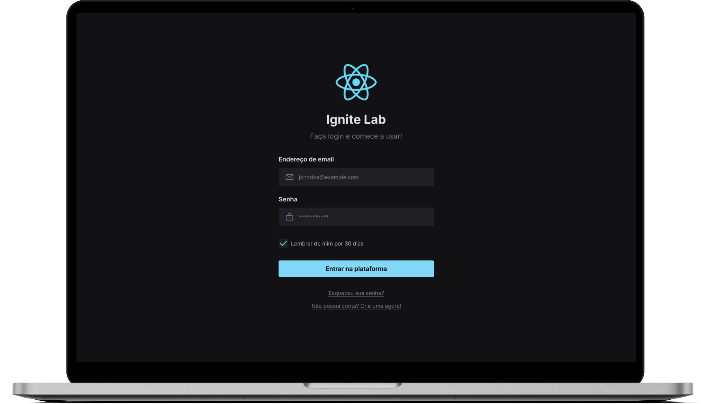
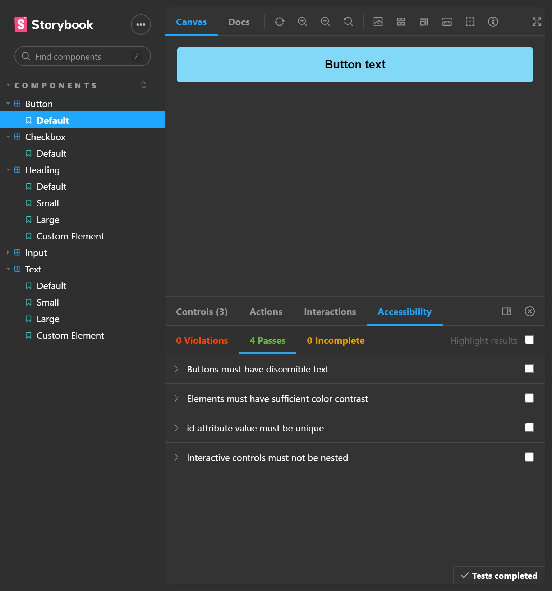

<h1 align="center">
  <a href="https://ignews-r9omlayqh-eduardoreisux.vercel.app" target="_blank" title="Visite o site">
    </img>
  </a>
</h1>

<p align="center">
  <a href="#ℹ-descrição">Descrição</a> •
  <a href="#-tecnologias">Tecnologias</a> •
  <a href="#-pré-requisitos">Pré-requisitos</a> •
  <a href="#-como-usar">Como usar</a> •
  <a href="#-demonstração">Demonstração</a>
</p>

<p align="center">
  </img>
</p>

## ℹ Descrição

Projeto desenvolvido ao longo do Ignite Lab #04. 👨‍🚀🚀

Este projeto é uma página de cadastro de usuário, seguindo o Design no Figma. O foco da aplicação está na documentação de componentes criados através do Storybook, além de acessibilidade com RadixUI e addon de a11y do Storybook. 

## ⚒ Tecnologias

- [**React**](https://pt-br.reactjs.org)
- [**Typescript**](https://www.typescriptlang.org)
- [**Storybook**](https://storybook.js.org/)
- [**TailwindCSS**](https://tailwindcss.com/)
- [**RadixUI**](https://www.radix-ui.com/)
- [**Vite**](https://vitejs.dev/)

## ⚙ Pré-requisitos

- [Git](https://git-scm.com)
- [Yarn](https://yarnpkg.com) ou [NPM](https://www.npmjs.com/)

## 🖥 Como usar

**Clone o projeto e acesse a pasta**

```bash
$ git clone https://github.com/EduardoReisUX/react-storybook.git && cd react-storybook
```

**Siga os passos seguintes**

```bash
# Instale as dependências
$ yarn

# Rode a aplicação
$ yarn dev

# Veja a documentação dos componentes no Storybook
$ yarn storybook
```

## 👀 Demonstração

<p align="center">
</img>
</p>

---

<p align="center">Feito com 💜 por <a href="https://github.com/EduardoReisUX">Eduardo dos Reis</a></p>
